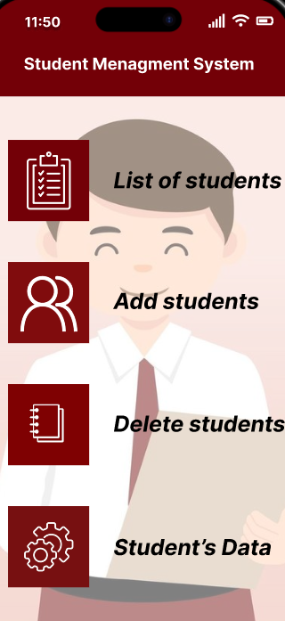

# Student Management System

**Student Management System** është një aplikacion i thjeshtë në C++ që lejon menaxhimin e të dhënave të studentëve. 
Ky projekt është zhvilluar nga një grup prej katër personash si një mini-projekt për praktikë në programim.

---

## 🚀 Funksionalitetet Kryesore

- ✅ Shtimi i studentëve të rinj
- ✅ Shfaqja e listës së studentëve
- ✅ Kërkimi i studentëve sipas ID ose emrit
- ✅ Përditësimi i të dhënave të studentëve
- ✅ Fshirja e studentëve nga lista
- ✅ Ruajtja dhe leximi i të dhënave nga file

---

## 🛠 Teknologjitë e Përdorura

- **Gjuha e Programimit:** C++
- **Mjedisi i Zhvillimit:** Kompiler C++ (Code::Blocks,  Visual Studio Code, etj.)
- **Kontrolli i Versioneve:** Git & GitHub

---

---

## 👨‍💻 Kontributet

**Ky projekt është zhvilluar nga:**

- Djellza Jakupi - Shtimi i studentëve dhe menaxhimi i strukturës së të dhënave
- Luljeta Hoti - Shfaqja dhe kërkimi i studentëve
- Medina Bajgora - Përditësimi dhe fshirja e të dhënave të studentëve
- Sara Gashi - Ruajtja dhe leximi i të dhënave nga file
